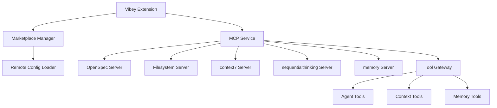

# MCP Marketplace Integration Documentation

## Overview

This document provides comprehensive documentation for the MCP (Model Context Protocol) marketplace integration in Vibey. The integration adds support for context7, sequentialthinking, and memory MCP servers as specified in the MCP_SERVER_INTEGRATION_REPORT.md.

## Table of Contents

1. [Architecture Overview](#architecture-overview)
2. [New Components](#new-components)
3. [Marketplace Integration](#marketplace-integration)
4. [Server-Specific Implementations](#server-specific-implementations)
5. [Configuration and Settings](#configuration-and-settings)
6. [Usage Guide](#usage-guide)
7. [Migration Guide](#migration-guide)
8. [Troubleshooting](#troubleshooting)
9. [API Reference](#api-reference)

## Architecture Overview

The MCP marketplace integration follows a modular architecture that extends Vibey's existing MCP infrastructure:



## New Components

### 1. Marketplace Manager (`src/services/marketplace/MarketplaceManager.ts`)

**Responsibilities:**
- Discover and manage MCP servers from marketplace
- Cache marketplace data with configurable TTL
- Provide search and filtering capabilities
- Handle server installation and uninstallation

**Key Features:**
- 5-minute caching to reduce network requests
- Event-based notifications for marketplace updates
- Support for server metadata (tags, versions, authors)
- Error handling and fallback to cached data

### 2. Remote Configuration Loader (`src/services/marketplace/RemoteConfigLoader.ts`)

**Responsibilities:**
- Load MCP configurations from remote sources
- Cache remote configurations with configurable TTL
- Handle authentication and error scenarios

**Key Features:**
- 15-minute default cache TTL
- Support for multiple remote sources
- Graceful degradation on network errors

### 3. Memory Service (`src/agent/mcp/memory_service.ts`)

**Responsibilities:**
- Manage memory bank for persistent context storage
- Monitor memory usage and provide warnings
- Support memory context operations (CRUD)

**Key Features:**
- Memory bank storage in `.kilocode/rules/memory-bank/`
- Memory usage monitoring with configurable limits
- Context tagging and importance-based retrieval
- Automatic memory cleanup warnings

### 4. MCP Marketplace View (`src/ui/marketplace/McpMarketplaceView.ts`)

**Responsibilities:**
- Provide UI for browsing marketplace servers
- Handle server installation/uninstallation
- Display server information and status

**Key Features:**
- Responsive grid layout for server cards
- Search and filtering capabilities
- Real-time status updates
- Installation progress indicators

## Marketplace Integration

### Marketplace Server Discovery

The marketplace integration automatically discovers and loads MCP servers when:

1. **Extension Activation**: Marketplace servers are loaded during extension startup
2. **Manual Refresh**: Users can manually refresh marketplace data via command
3. **Configuration Change**: Marketplace is reloaded when settings change

### Server Installation Process

1. **Discovery**: User browses available servers in marketplace
2. **Selection**: User selects a server to install
3. **Configuration**: Server configuration is added to `vibey.mcpServers` setting
4. **Connection**: MCP service automatically connects to the new server
5. **Tool Registration**: Server tools are registered with the tool gateway

### Server Uninstallation Process

1. **Disconnection**: Server is disconnected from MCP service
2. **Tool Cleanup**: Server tools are unregistered from tool gateway
3. **Configuration Removal**: Server configuration is removed from settings
4. **State Cleanup**: Server state is cleared from MCP service

## Server-Specific Implementations

### 1. context7 MCP Server

**Functionality:**
- Context management and resolution
- Library and dependency identification
- Tool: `mcp_context7_resolve-library-id` for resolving library contexts

**Configuration:**
```typescript
{
    command: 'context7-server',
    args: ['--mcp-mode'],
    env: { 
        CONTEXT7_API_KEY: process.env.CONTEXT7_API_KEY || ''
    },
    timeout: 15000,
    autoReconnect: true
}
```

**Use Cases:**
- Resolving complex library dependencies
- Context-aware code analysis
- Dependency graph visualization

### 2. sequentialthinking MCP Server

**Functionality:**
- Sequential task processing and reasoning
- Multi-step problem solving
- Context-aware decision making

**Configuration:**
```typescript
{
    command: 'sequentialthinking-server',
    args: ['--mcp-mode'],
    timeout: 10000,
    autoReconnect: true
}
```

**Use Cases:**
- Complex problem decomposition
- Multi-step reasoning tasks
- Sequential workflow execution

### 3. memory MCP Server

**Functionality:**
- Memory bank management
- Persistent context storage between sessions
- Memory usage monitoring and optimization
- Task history and recall

**Configuration:**
```typescript
{
    command: 'memory-server',
    args: ['--mcp-mode', '--memory-dir', '.kilocode/rules/memory-bank/'],
    timeout: 10000,
    autoReconnect: true
}
```

**Use Cases:**
- Persistent context across sessions
- Memory-augmented reasoning
- Historical context retrieval
- Memory usage optimization

## Configuration and Settings

### New Configuration Options

#### Marketplace Settings

```json
{
    "vibey.mcpMarketplaceEnabled": {
        "type": "boolean",
        "default": true,
        "description": "Enable MCP marketplace integration"
    },
    "vibey.mcpMarketplaceAutoUpdate": {
        "type": "boolean",
        "default": true,
        "description": "Automatically check for marketplace updates"
    }
}
```

#### Memory Settings

```json
{
    "vibey.memoryBankEnabled": {
        "type": "boolean",
        "default": true,
        "description": "Enable memory bank for persistent context storage"
    },
    "vibey.memoryMaxSizeMB": {
        "type": "number",
        "default": 100,
        "description": "Maximum memory bank size in MB (50-500 recommended)"
    }
}
```

### Commands

#### Marketplace Commands

- **`vibey.showMcpMarketplace`**: Show MCP marketplace UI
- **`vibey.refreshMcpMarketplace`**: Refresh marketplace data

#### MCP Commands (Enhanced)

- **`vibey.mcpStatus`**: Show MCP server status (now includes marketplace servers)
- **`vibey.mcpReload`**: Reload MCP servers (now includes marketplace servers)
- **`vibey.mcpListTools`**: List all tools (now includes marketplace server tools)

## Usage Guide

### Accessing the Marketplace

1. **Via Command Palette**:
   - Press `Ctrl+Shift+P` (Windows/Linux) or `Cmd+Shift+P` (Mac)
   - Search for "Vibey: Show MCP Marketplace"
   - Select the command to open the marketplace view

2. **Via Command**:
   ```bash
   # Open marketplace
   vibey.showMcpMarketplace
   
   # Refresh marketplace data
   vibey.refreshMcpMarketplace
   ```

### Installing a Server

1. **Browse Servers**: Navigate through available servers in the marketplace
2. **View Details**: Click on a server card to see detailed information
3. **Install**: Click the "Install" button to add the server to your configuration
4. **Confirm**: The server will automatically connect and register its tools

### Managing Installed Servers

1. **View Status**: Use `vibey.mcpStatus` to see all connected servers
2. **Reload Servers**: Use `vibey.mcpReload` to reconnect all servers
3. **Uninstall**: In the marketplace view, installed servers show an "Uninstall" button

### Using Memory Features

The memory service is automatically integrated and provides:

- **Automatic Context Persistence**: Context is automatically saved between sessions
- **Memory Warnings**: Notifications when memory usage is high
- **Memory Management**: Tools to clear old memory entries

## Migration Guide

### For Existing Vibey Users

The MCP marketplace integration is **backward compatible**. Existing configurations will continue to work:

1. **Automatic Migration**: Existing MCP configurations remain unchanged
2. **Opt-in Marketplace**: Users can enable marketplace through settings
3. **Gradual Rollout**: New MCP servers available through marketplace

### Migration Steps

1. **Update Vibey**: Install the latest version with marketplace support
2. **Review Settings**: Check new marketplace and memory settings
3. **Explore Marketplace**: Browse available MCP servers
4. **Install Servers**: Add servers as needed for your workflow

### Configuration Examples

#### Basic Marketplace Setup

```json
// settings.json
{
    "vibey.mcpMarketplaceEnabled": true,
    "vibey.mcpMarketplaceAutoUpdate": true,
    "vibey.memoryBankEnabled": true,
    "vibey.memoryMaxSizeMB": 100
}
```

#### Advanced Setup with Specific Servers

```json
// settings.json
{
    "vibey.mcpMarketplaceEnabled": true,
    "vibey.mcpServers": {
        "context7": {
            "command": "context7-server",
            "args": ["--mcp-mode", "--verbose"],
            "env": {
                "CONTEXT7_API_KEY": "your-api-key-here"
            },
            "timeout": 20000,
            "autoReconnect": true
        },
        "memory": {
            "command": "memory-server",
            "args": ["--mcp-mode", "--memory-dir", ".kilocode/rules/memory-bank/"]
        }
    }
}
```

## Troubleshooting

### Common Issues and Solutions

#### Marketplace Not Loading

**Symptoms:**
- Marketplace view shows "Loading..." indefinitely
- No servers appear in marketplace

**Solutions:**
1. Check marketplace setting: `vibey.mcpMarketplaceEnabled` should be `true`
2. Refresh marketplace: Use `vibey.refreshMcpMarketplace` command
3. Check extension output for errors
4. Restart VS Code

#### Server Installation Fails

**Symptoms:**
- Server installation shows error message
- Server doesn't appear in connected servers list

**Solutions:**
1. Check server requirements (e.g., context7-server must be installed)
2. Verify command paths in server configuration
3. Check environment variables (e.g., API keys)
4. Review extension output for specific error details

#### Memory Warnings

**Symptoms:**
- "Memory usage is high" warnings appear
- Performance degradation with memory features

**Solutions:**
1. Clear old memory entries using the memory management UI
2. Increase memory limit in settings: `vibey.memoryMaxSizeMB`
3. Review and remove unnecessary memory contexts
4. Disable memory bank if not needed: `vibey.memoryBankEnabled: false`

#### Connection Issues

**Symptoms:**
- Servers show "error" status
- Tools from marketplace servers don't work

**Solutions:**
1. Check server processes are running
2. Verify network connectivity
3. Review server logs for startup errors
4. Try manual reload: `vibey.mcpReload`

### Debugging Commands

```bash
# Show detailed MCP status
vibey.mcpStatus

# Reload all MCP servers
vibey.mcpReload

# List all available tools
vibey.mcpListTools

# Check extension output
# View > Output, then select "Vibey" from dropdown
```

## API Reference

### MarketplaceManager API

```typescript
// Initialize
const marketplaceManager = new MarketplaceManager(cacheTTL?);

// Load servers
const servers = await marketplaceManager.loadMarketplaceServers();

// Get specific server
const server = await marketplaceManager.getServerById('context7');

// Search servers
const results = await marketplaceManager.searchServers('memory');

// Cache management
marketplaceManager.clearCache();
const cachedServers = marketplaceManager.getCachedServers();
```

### RemoteConfigLoader API

```typescript
// Initialize
const configLoader = new RemoteConfigLoader(defaultCacheTTL?);

// Load remote configuration
const config = await configLoader.loadRemoteConfig({
    url: 'https://example.com/mcp-config',
    authToken: 'optional-auth-token'
});

// Cache management
configLoader.clearCache('specific-url');
configLoader.clearAllCache();
```

### MemoryService API

```typescript
// Initialize
const memoryService = new MemoryService(mcpService, context);

// Load memory bank
await memoryService.loadMemoryBank();

// Create and store memory context
const memoryContext = memoryService.createMemoryContext(
    'session-id',
    { key: 'value' },
    'source',
    { importance: 1, tags: ['tag1', 'tag2'] }
);
await memoryService.updateMemoryBank(memoryContext);

// Retrieve memory
const context = await memoryService.getMemoryContext('session-id');
const allContexts = await memoryService.getAllMemoryContexts();

// Search memory
const taggedContexts = await memoryService.searchMemoryByTags(['tag1']);
const importantContexts = await memoryService.getMemoryByImportance();
const recentContexts = await memoryService.getRecentMemory(10);

// Memory management
await memoryService.removeMemoryContext('session-id');
await memoryService.clearMemoryBank();

// Statistics
const stats = memoryService.getMemoryStats();
```

### MCP Service Marketplace Methods

```typescript
// Get available marketplace servers
const marketplaceServers = await mcpService.getMarketplaceServers();

// Install a marketplace server
const success = await mcpService.installMarketplaceServer('context7');

// Uninstall a marketplace server
const removed = await mcpService.uninstallMarketplaceServer('context7');

// Refresh marketplace data
await mcpService.refreshMarketplace();
```

## Performance Considerations

### Caching Strategy

- **Marketplace Data**: Cached for 5 minutes by default
- **Remote Configurations**: Cached for 15 minutes by default
- **Memory Bank**: Loaded on demand and cached in memory

### Memory Management

- **Default Limit**: 100MB memory bank size
- **Monitoring**: Automatic warnings at 50%, 75%, and 90% usage
- **Cleanup**: Manual and automatic memory cleanup options

### Network Optimization

- **Batch Operations**: Multiple server operations are batched
- **Parallel Loading**: Servers are loaded in parallel where possible
- **Error Handling**: Graceful degradation on network failures

## Security Considerations

### Configuration Validation

- All marketplace configurations are validated before use
- Environment variables are sanitized
- Server commands are validated against allowed patterns

### Data Protection

- Memory bank data is stored in workspace-specific directory
- Sensitive data (API keys) is handled through environment variables
- Configuration data is validated before storage

### Access Control

- Marketplace operations require user confirmation
- Server installation/uninstallation is logged
- Configuration changes are audited

## Future Enhancements

### Planned Features

1. **Server Updates**: Automatic update notifications for installed servers
2. **Server Ratings**: Community ratings and reviews for marketplace servers
3. **Organization Servers**: Support for private/organization-specific servers
4. **Server Dependencies**: Automatic dependency resolution for complex servers
5. **Enhanced Memory**: Advanced memory search and retrieval algorithms

### Roadmap

- **Q1 2026**: Server update notifications and organization servers
- **Q2 2026**: Enhanced memory features and performance optimizations
- **Q3 2026**: Community features and server marketplace improvements

## Support and Resources

### Getting Help

- **Documentation**: This document and inline code comments
- **Extension Output**: View > Output > Vibey for detailed logs
- **Issue Tracker**: Report issues on GitHub
- **Community**: Join the Vibey community for discussions

### Learning Resources

- **MCP Protocol Documentation**: Official MCP protocol specification
- **Vibey Examples**: Example configurations and use cases
- **Tutorials**: Step-by-step guides for advanced features

## Conclusion

The MCP marketplace integration significantly enhances Vibey's capabilities by:

1. **Extensibility**: Easy discovery and installation of new MCP servers
2. **Context Management**: Advanced context7 server for dependency resolution
3. **Reasoning**: Sequential thinking server for complex problem solving
4. **Memory**: Persistent memory bank for context across sessions
5. **Ecosystem**: Access to growing marketplace of community servers

This integration maintains full backward compatibility while providing powerful new features that can be adopted gradually.

## Appendix

### Glossary

- **MCP**: Model Context Protocol - Protocol for external tool integration
- **Marketplace**: Repository of available MCP servers
- **Memory Bank**: Persistent storage for context and session data
- **Context Resolution**: Process of identifying and managing code contexts
- **Sequential Thinking**: Multi-step reasoning and problem solving

### File Locations

- **Marketplace Manager**: `src/services/marketplace/MarketplaceManager.ts`
- **Remote Config Loader**: `src/services/marketplace/RemoteConfigLoader.ts`
- **Memory Service**: `src/agent/mcp/memory_service.ts`
- **MCP Service**: `src/agent/mcp/mcp_service.ts`
- **Marketplace View**: `src/ui/marketplace/McpMarketplaceView.ts`
- **UI Assets**: `src/ui/media/marketplace.*`
- **Tests**: `src/test/mcp_marketplace.test.ts`

### Configuration Files

- **Settings**: `.vscode/settings.json` (workspace) or VS Code settings
- **Memory Bank**: `.kilocode/rules/memory-bank/` (workspace directory)
- **Server Configs**: Stored in VS Code configuration system

This documentation provides a comprehensive guide to the MCP marketplace integration. For the latest updates and additional resources, refer to the official Vibey documentation and community resources.