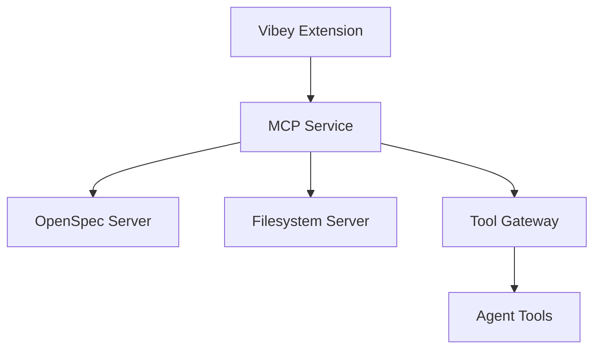
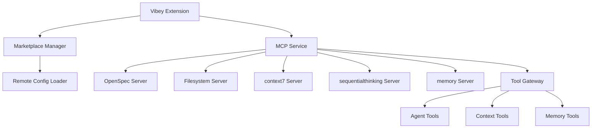

# MCP Server Integration Report: Adding Compatibility for context7, sequentialthinking, and memory

## Executive Summary

This report analyzes the Model Context Protocol (MCP) server implementations in both the Kilo Code repository and Vibey's current implementation, with the goal of adding compatibility for specific MCP servers: context7, sequentialthinking, and memory.

## Current State Analysis

### Vibey's MCP Implementation

Vibey currently has a robust MCP infrastructure with the following key components:

1. **MCP Service Architecture** (`src/agent/mcp/mcp_service.ts`):
   - Manages connections to MCP servers using the `@modelcontextprotocol/sdk`
   - Supports tool discovery, resource management, and prompt handling
   - Implements automatic server reconnection and state management
   - Provides built-in servers: OpenSpec and Filesystem MCP servers

2. **MCP Server Configuration** (`package.json`):
   - Uses `@modelcontextprotocol/sdk` version 1.24.3
   - Supports configuration through `vibey.mcpServers` setting
   - Includes MCP-related commands in VS Code extension

3. **Current MCP Servers**:
   - `openspec-builtin`: Built-in OpenSpec server for specification management
   - `filesystem-builtin`: Testing filesystem server with basic file operations

### Kilo Code's MCP Implementation

Kilo Code has a more mature MCP ecosystem with:

1. **Marketplace Integration**:
   - Comprehensive MCP marketplace system (`src/services/marketplace/`)
   - Remote configuration loading from marketplace APIs
   - Installation and management of MCP servers through UI

2. **MCP Server Types**:
   - Community-created servers available through marketplace
   - Organization-specific MCP servers
   - Support for both project-level and global MCP configurations

3. **Key MCP Servers Identified**:
   - `context7`: Referenced in tool validation tests
   - Memory-related functionality: Extensive memory management features
   - Sequential thinking: Implied through task management patterns

## Key MCP Servers to Integrate

### 1. context7 MCP Server

**Functionality**:
- Context management and resolution
- Library and dependency identification
- Tool: `mcp_context7_resolve-library-id` for resolving library contexts

**Integration Requirements**:
- Add context7 server configuration to marketplace
- Support context resolution tools in Vibey's tool gateway
- Implement proper error handling for context operations

### 2. sequentialthinking MCP Server

**Functionality**:
- Sequential task processing and reasoning
- Multi-step problem solving
- Context-aware decision making

**Integration Requirements**:
- Add sequential thinking patterns to task orchestration
- Support for sequential tool chaining
- Memory management for multi-step processes

### 3. memory MCP Server

**Functionality**:
- Memory bank management (extensively documented in Kilo Code)
- Persistent context storage between sessions
- Memory usage monitoring and optimization
- Task history and recall

**Integration Requirements**:
- Memory bank file management (`.kilocode/rules/memory-bank/`)
- Session persistence and context loading
- Memory usage telemetry and warnings

## Technical Implementation Plan

### Phase 1: Infrastructure Enhancement

1. **Enhance MCP Service** (`src/agent/mcp/mcp_service.ts`):
   ```typescript
   // Add support for marketplace-based MCP server discovery
   private async loadMarketplaceServers(): Promise<void> {
       // Implement marketplace API integration
   }
   ```

2. **Add Marketplace Integration** (`src/services/marketplace/`):
   - Create `MarketplaceManager.ts` for server discovery
   - Implement `RemoteConfigLoader.ts` for fetching MCP configurations
   - Add UI components for MCP marketplace browsing

### Phase 2: Server-Specific Integration

1. **context7 Server Integration**:
   ```typescript
   // Add context7 server configuration
   private getContext7ServerConfig(): McpServerConfig {
       return {
           command: 'context7-server',
           args: ['--mcp-mode'],
           env: { CONTEXT7_API_KEY: process.env.CONTEXT7_API_KEY }
       };
   }
   ```

2. **sequentialthinking Server Integration**:
   ```typescript
   // Add sequential thinking support to orchestrator
   async processSequentialTask(task: SequentialTask): Promise<void> {
       // Implement multi-step processing
   }
   ```

3. **memory Server Integration**:
   ```typescript
   // Add memory bank management
   class MemoryService {
       private memoryBankPath: string;
       
       async loadMemoryBank(): Promise<MemoryContext> {
           // Load from .kilocode/rules/memory-bank/
       }
       
       async updateMemoryBank(context: MemoryContext): Promise<void> {
           // Persist memory updates
       }
   }
   ```

### Phase 3: UI and Configuration

1. **Add MCP Marketplace UI**:
   - Create marketplace view in sidebar
   - Add MCP server installation/management interface
   - Implement server status monitoring

2. **Enhance Settings**:
   ```json
   // Add to package.json
   "vibey.mcpMarketplaceEnabled": {
       "type": "boolean",
       "default": true,
       "description": "Enable MCP marketplace integration"
   }
   ```

## Architecture Comparison

### Vibey's Current Architecture



### Proposed Enhanced Architecture



## Implementation Recommendations

### 1. Backward Compatibility
- Maintain existing MCP server configurations
- Add migration path for existing users
- Preserve current tool registration patterns

### 2. Performance Considerations
- Implement caching for marketplace data (5-minute cache)
- Add memory usage monitoring for memory server
- Optimize sequential processing to avoid blocking

### 3. Security Considerations
- Validate all marketplace MCP configurations
- Implement organization-level MCP controls
- Add telemetry for MCP tool usage

### 4. Testing Strategy
- Unit tests for new MCP service methods
- Integration tests for marketplace functionality
- End-to-end tests for context7, sequentialthinking, and memory servers
- Performance tests for memory management

## Migration Path

### For Existing Vibey Users
1. **Automatic Migration**: Existing MCP configurations remain unchanged
2. **Opt-in Marketplace**: Users can enable marketplace through settings
3. **Gradual Rollout**: New MCP servers available through marketplace

### For New Features
1. **context7**: Available as optional marketplace item
2. **sequentialthinking**: Integrated into core task processing
3. **memory**: Available as persistent context management

## Expected Benefits

1. **Enhanced Context Awareness**: context7 provides better library and dependency resolution
2. **Improved Reasoning**: sequentialthinking enables multi-step problem solving
3. **Persistent Memory**: memory server maintains context between sessions
4. **Extensibility**: Marketplace allows for future MCP server additions
5. **Community Integration**: Access to community-created MCP servers

## Risks and Mitigations

| Risk | Mitigation Strategy |
|------|-------------------|
| Memory usage increases | Implement memory monitoring and warnings |
| Performance degradation | Add caching and optimize sequential processing |
| Security vulnerabilities | Validate all marketplace configurations |
| Complexity increase | Maintain backward compatibility and gradual rollout |
| User confusion | Clear documentation and UI guidance |

## Conclusion

Integrating context7, sequentialthinking, and memory MCP servers will significantly enhance Vibey's capabilities by providing better context management, improved reasoning, and persistent memory. The proposed implementation leverages Vibey's existing MCP infrastructure while adding marketplace integration for extensibility.

The implementation should follow a phased approach, starting with infrastructure enhancements, followed by server-specific integrations, and finally UI and configuration improvements. This approach ensures backward compatibility while enabling powerful new features.

## Next Steps

1. ✅ Complete analysis of Kilo Code's MCP implementation
2. ✅ Compare with Vibey's current MCP infrastructure
3. ✅ Identify key MCP servers and their functionalities
4. ⏳ Prepare detailed implementation plan for each MCP server
5. ⏳ Develop marketplace integration components
6. ⏳ Implement server-specific functionality
7. ⏳ Create comprehensive test suite
8. ⏳ Document new features and migration path